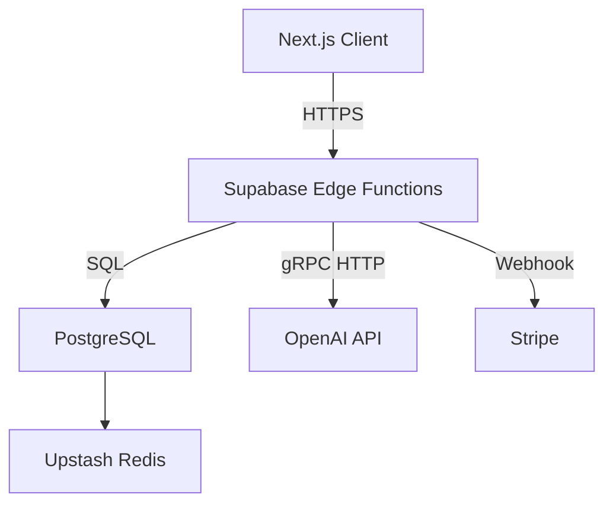

# 기술 요구 사항 문서 (TRD)

## 1. 기술 총괄 요약
- **프로젝트 개요**  
  IT 마케터용 제안서 자동화 SaaS를 Next.js 기반 SPA/SSR 혼합 아키텍처와 Supabase 백엔드를 활용하여 30분 내 초안 작성을 지원하는 웹 애플리케이션으로 구축한다. 모든 서버리스·매니지드 서비스를 적극 활용해 팀 규모 대비 운영‧배포 부담을 최소화한다.

- **핵심 기술 스택**  
  Frontend: Next.js 15 (App Router) + React 19 + TypeScript + Tailwind CSS  
  Backend: Supabase(PostgreSQL, Edge Functions) + OpenAI GPT-4 API + Clearbit/Crunchbase API  
  Infra: Vercel(Serverless) + Cloudflare CDN + Sentry/Grafana

- **주요 기술 목표**  
  1. AI 리포트 평균 응답 ≤ 3초, 초안 렌더링 ≤ 5분  
  2. 동시 접속 10,000명까지 성능 저하 없이 확장  
  3. OAuth2·RBAC·AES-256 암호화로 개인정보 및 결제 정보 보호  
  4. 99.9% 가용성, 장애 복구 RTO 30분 / RPO 5분

- **핵심 가정**  
  - 초기 사용자는 수천 명 수준이며 서버리스 과금으로 비용 효율성을 확보한다.  
  - AI 모델 호출 비용은 RAG 캐싱과 프롬프트 최적화로 월 예산 내 관리 가능하다.  
  - Supabase가 제공하는 인증·DB·스토리지를 활용해 별도 서버 유지보수를 최소화한다.

---

## 2. 기술 스택 아키텍처

### 프런트엔드 스택
- **코어 프레임워크**: Next.js 15.1.0 (React 19, TypeScript 5.x, App Router)  
- **상태 관리**: Zustand(전역) + @tanstack/react-query(서버 상태)  
- **라우팅**: Next.js App Router (파일 기반·동적 경로)  
- **UI/UX**: Tailwind CSS + shadcn-ui + Framer Motion + Lucide React + next-themes  
- **빌드 도구**: Vercel 빌드, Turbopack, ESLint, Prettier, PostCSS, tailwind-merge

### 백엔드 스택
- **런타임**: Node.js 20 (V8) on Vercel Edge Functions  
- **웹 프레임워크**: Supabase Edge Functions (Deno) + Hono (경량 미들웨어)  
- **API 디자인**: RESTful JSON (OpenAPI 3.1 스펙 문서화)  
- **데이터 검증**: Zod 스키마, class-validator (DTO 레이어)  
- **미들웨어**: JWT 검증, rate-limiting, Sentry 트레이싱, CORS, 압축

### 데이터베이스 & 영속 계층
- **주 데이터베이스**: Supabase PostgreSQL (Managed)  
- **스키마 설계**: 3정규형 + JSONB(유연 필드) 조합, 다중 테넌시용 `workspace_id` 파티셔닝  
- **캐시 전략**: Redis@Upstash (RAG 임베딩, 세션, AI 응답 캐싱)  
- **마이그레이션**: Supabase Migrations CLI (SQL) + GitHub Actions 자동 적용  
- **백업·복구**: Supabase Point-in-Time Recovery, 주 1회 스냅샷, S3 오프사이트 백업

### 인프라 & DevOps
- **호스팅**: Vercel(Serverless Functions·Edge), Supabase Cloud, Cloudflare CDN/Zero-Trust  
- **컨테이너화**: 불필요(서버리스), 필요 시 Docker 로컬 개발만 지원  
- **CI/CD**: GitHub Actions → Vercel Preview/Production 자동 배포, Supabase DB Diff 적용  
- **모니터링·가시성**: Vercel Analytics, Grafana Cloud(Tempo/Loki), Sentry APM  
- **로그 전략**: Supabase & Vercel 로그 → Grafana Loki 중앙 집계, 30일 보존

---

## 3. 시스템 아키텍처 설계

### 최상위 빌딩 블록
- 프런트엔드 Next.js 앱 (CSR + SSR 혼합)  
  - 온보딩/대시보드/에디터/설정 모듈  
- 백엔드 API (Supabase Edge Functions)  
  - 인증·RBAC, AI 라우터, 데이터 CRUD, 결제 Webhook  
- AI 모듈  
  - GPT-4 호출, embeddings 저장, RAG 검색, 프롬프트 템플릿  
- 데이터베이스 레이어  
  - PostgreSQL 테이블·뷰, 정책(RLS), Row-Level 보호  
- 외부 통합  
  - Clearbit/Crunchbase, Stripe, OAuth 소셜, Cloudflare Turnstile

### 최상위 컴포넌트 상호 작용 다이어그램

- 클라이언트는 Edge Functions REST 엔드포인트를 호출해 데이터·AI 요청을 처리한다.  
- Edge Functions는 Postgres RLS 정책을 적용하여 안전하게 CRUD를 수행한다.  
- AI 요청은 OpenAI API로 프록시하며 결과·임베딩을 Redis에 캐시한다.  
- 결제 이벤트는 Stripe Webhook으로 수신, 사용권·요금제 테이블에 반영한다.

### 코드 구성 & 컨벤션

**도메인 중심 조직 전략**
- 사용자, 워크스페이스, 프로젝트, AI, 결제 등 도메인별 디렉터리 분리  
- presentation → application → domain → infrastructure 4계층 패턴 적용  
- 공통 타입·훅·UI 컴포넌트는 `shared` 모듈에 집중 관리

**공통 폴더 구조**
```
/project-root
├── frontend/
│   ├── src/
│   │   ├── app/               # Next.js App Router
│   │   ├── domains/
│   │   │   ├── auth/
│   │   │   ├── proposal/
│   │   │   ├── workspace/
│   │   │   └── payment/
│   │   ├── components/
│   │   ├── hooks/
│   │   ├── services/          # API client
│   │   ├── stores/            # Zustand
│   │   └── utils/
│   └── package.json
├── backend/
│   ├── functions/
│   │   ├── auth/
│   │   ├── ai/
│   │   ├── proposal/
│   │   ├── payment/
│   │   └── utils/
│   └── supabase.toml
├── database/
│   ├── migrations/
│   ├── seeds/
│   └── schema.sql
└── infrastructure/
    ├── github-actions/
    ├── scripts/
    └── monitoring/
```

### 데이터 플로우 & 통신 패턴
- **클라이언트 ↔ 서버**: RESTful JSON, SWR 캐싱, react-query 옵티미스틱 업데이트  
- **DB 상호작용**: Edge Function → Postgres via Supabase client, Row-Level Security  
- **외부 API**: Server-side fetch with retry, circuit-breaker, typed response mapping  
- **실시간**: Supabase Realtime WebSocket으로 협업 편집 presence 기능 구현 예정  
- **데이터 동기화**: react-query + Supabase hooks로 클라이언트 캐시 일관성 유지

---

## 4. 성능 및 최적화 전략
- RAG 검색 결과와 AI 응답을 Redis TTL 24h 캐싱, 동일 쿼리 재사용  
- Next.js App Router의 `server-components`로 초기 데이터 SSR, 나머지는 ISR 캐싱  
- 이미지·정적 자산은 Vercel Edge Cache + Cloudflare CDN으로 오프로드  
- Database: 인덱스 설계, `pgvector` 임베딩 컬럼 ANN 인덱스, 비동기 Batch upsert

---

## 5. 구현 로드맵 & 마일스톤

### Phase 1: Foundation (0~3개월)
- **코어 인프라**: Vercel 프로젝트, Supabase 인스턴스, 기본 CI/CD  
- **핵심 기능**: 온보딩 설문, 고객사 분석, 단일 템플릿 초안 생성  
- **보안**: OAuth2 소셜 로그인, RLS, HTTPS 강제  
- **개발 환경**: Storybook, Husky pre-commit, 기본 테스트 셋업  
- **타임라인**: M1 완료 후 사용자 피드백 2주 수렴

### Phase 2: Feature Enhancement (4~6개월)
- **고급 기능**: 전략 추천 다중안, 인터랙티브 편집, PDF/PPT 내보내기  
- **성능 최적화**: Redis 캐시, 가변 컨커런시 제어, AI 비용 관리  
- **보안 강화**: 2FA, 조직별 RBAC, SSO 준비  
- **모니터링**: Grafana 대시보드, Alertmanager 슬랙 연동  
- **타임라인**: Phase 2 종료 시 공개 베타

### Phase 3: Scaling & Optimization (7~9개월)
- **스케일 아웃**: Supabase 읽기 복제, Edge Region 확장  
- **고급 통합**: CRM 연동, 템플릿 마켓플레이스, Stripe Billing 퍼 블록  
- **엔터프라이즈**: 감사 로그, 데이터 지역화 옵션, SLA 99.9%  
- **컴플라이언스**: GDPR/CCPA 대응, 정기 Pen-Test  
- **타임라인**: 정식 출시 및 마케팅 캠페인 개시

---

## 6. 리스크 평가 및 완화 전략

### 기술 리스크
| 리스크 | 설명 | 완화 방안 |
| --- | --- | --- |
| AI 품질 변동 | GPT-4 모델 업데이트 시 성능 저하 가능 | 프롬프트 A/B, 벤더 다중화(OpenAI, Anthropic), RAG 캐시 |
| 크롤링 차단 | 고객사 웹 차단으로 데이터 부족 | Clearbit/Crunchbase API 백업, 캐시 저장 |
| 성능 병목 | 동시 요청 급증 시 Edge 콜드스타트 | 프리웨밍, Redis 큐, 미리 렌더링 |
| 보안 취약점 | PII·결제 데이터 유출 가능 | AES-256 at rest, Vault 키 관리, 정기 취약점 스캔 |

### 프로젝트 전달 리스크
| 리스크 | 설명 | 대응 |
| --- | --- | --- |
| 일정 지연 | 외부 API 한도 또는 인력 부족 | 기능 우선순위 재조정, 범위 축소 |
| 리소스 부족 | AI 비용 초과 | 토큰 최적화, 요금제 조정 |
| 품질 저하 | 테스트 커버리지 부족 | CI 테스트 게이트, QA 스프린트 |
| 배포 사고 | 잘못된 마이그레이션 | Blue-Green 배포, DB 롤백 스크립트 |

---

끝.